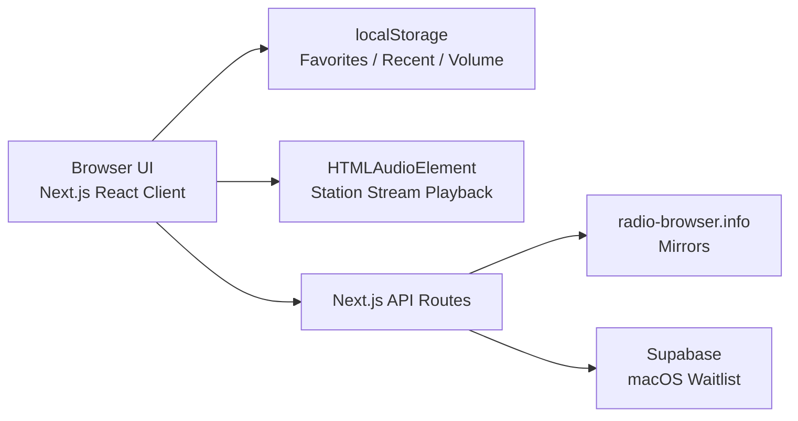

# RadioApp Web MVP Design

Date: 2026-06-09
Status: Approved for implementation planning

## Summary

RadioApp will add a lightweight web client under `/WebApp`. The web MVP is a real radio listening product, not a marketing landing page and not a complete SaaS rewrite. Its first job is simple: let people open a browser and listen to stations quickly.

The commercial path for the first version is:

1. Free web radio listening.
2. Recognition and advanced features point to a macOS waitlist.
3. The macOS app later carries native-only value such as ShazamKit recognition, richer background behavior, lyrics, and Pro features.

The iOS product is not part of the current conversion story because App Store distribution is not ready.

## Goals

- Build a responsive web MVP that works well on phones and naturally expands on desktop.
- Preserve the existing RadioApp visual identity from the SwiftUI app.
- Support discovery, search, playback, favorites, and recently played stations.
- Keep favorites and recent history local to the browser for the MVP.
- Use Next.js API routes as the product boundary for station data and waitlist submission.
- Store macOS waitlist emails in Supabase.
- Keep the first implementation small enough to ship and validate quickly.

## Non-Goals

- No real song recognition in the web MVP.
- No account system, login, cloud sync, or anonymous sync.
- No web subscriptions or payments.
- No iOS conversion path in the MVP.
- No widgets, Live Activities, lock-screen controls, or other native-only surfaces.
- No guarantee that every radio stream can play in the browser. Unsupported formats, CORS, broken streams, and station-side failures must be handled gracefully.

## Product Shape

The MVP uses a mobile-first feed layout. The first screen is the product experience itself:

- Home / Discover
- Search
- Favorites
- Recent Plays
- Mini Player
- Expanded Player
- macOS Waitlist Modal

Desktop should not become a separate product. It can use wider grids, a light side rail, and a more spacious player treatment, but it should preserve the same information architecture.

## Visual System

The web client must look and feel like the current SwiftUI app. The SwiftUI design system is the source of truth.

Web CSS variables should map directly to the existing `NeonColors` values:

- `cyan`: `#00D9FF`
- `magenta`: `#FF006E`
- `purple`: `#8338EC`
- `electric`: `#7B2CBF`
- `warmPink`: `#FF5E78`
- `mint`: `#00F5D4`
- `gold`: `#FFD23F`
- `red`: `#FF3B30`
- `darkBg`: `#0A0A0F`
- `cardBg`: `#151520`
- `surfaceBg`: `#1A1A2E`

Web components should port these SwiftUI patterns:

- `AnimatedMeshBackground`: dark base, cyan/purple/magenta radial glow, and subtle noise.
- `GlassmorphicBackground`: translucent dark surface, thin neon border, and restrained glow.
- `NeonGlow`: active controls and currently playing states.
- `PlayButton`: magenta/purple gradient, circular shape, and glow.
- `NeonSlider`: cyan active track.
- `StationAvatarView`: remote image loading with graceful gradient fallback.
- `PlaceholderView`: branded gradient fallback instead of broken image states.

The web MVP may adapt layout for browser ergonomics, but it must not introduce a new visual brand.

## Architecture

The new client lives in `/WebApp` and uses:

- Next.js
- TypeScript
- Supabase for waitlist persistence
- Browser local storage for favorites, recently played stations, volume, and lightweight UI preferences
- Standard HTML audio playback for stream URLs

High-level flow:



The frontend must not directly scatter radio-browser calls across components. The Next.js API layer owns mirror selection, request shaping, filtering, cache policy, and response normalization.

## API Design

### `GET /api/stations/top`

Returns recommended stations for the Home screen.

Initial behavior should mirror the Swift `RadioService.fetchTopStations` approach:

- Prefer China-focused music stations for the first curated list.
- Order by popularity/click count where available.
- Fetch a larger candidate pool server-side, then filter for music-related tags.
- Hide broken stations when the upstream API supports it.
- Normalize responses into the shared `Station` TypeScript type.

### `GET /api/stations/search?q=...`

Searches stations by keyword.

Initial behavior should mirror the Swift `searchStations` approach:

- Trim whitespace.
- Split keyword groups.
- Preserve the frequency helper behavior, such as matching `1017` to `101.7`.
- Return filtered results without disturbing current playback if the search fails.

### `GET /api/stations/random?exclude=...`

Returns one random playable candidate.

Behavior:

- Exclude the currently playing station when `exclude` is passed.
- Fetch a larger random pool.
- Filter with broad music/radio keyword logic.
- Return `null` or a clear error state when no candidate is available.

### `POST /api/waitlist`

Stores macOS waitlist submissions.

Request body:

```json
{
  "email": "user@example.com",
  "source": "recognition",
  "stationId": "optional-station-id",
  "userAgent": "optional-client-provided-user-agent"
}
```

Behavior:

- Validate email format server-side.
- Normalize email casing and whitespace.
- Store email, source, station context, timestamp, and user agent metadata in Supabase.
- Treat duplicate email submissions as success.
- Return privacy-conscious errors; do not expose Supabase internals to the client.

## Frontend State

Frontend state has three categories.

Playback state:

- Current station
- Current playlist
- Playlist title
- `isPlaying`
- `isLoading`
- `playbackError`
- Volume

Local persistent state:

- Favorite stations
- Recently played stations
- Volume
- Optional UI preferences

Remote state:

- Home station lists
- Search results
- Random station responses
- Waitlist submission result

The MVP can use React state plus focused hooks, or a small store if implementation complexity requires it. Avoid introducing global state machinery before it is useful.

## Playback Flow

1. User selects a station card.
2. The app sets the current playlist context and current station.
3. The `<audio>` element loads `station.urlResolved || station.url`.
4. Playback starts after a user gesture.
5. On successful playback, the station is added to recent plays.
6. The mini player appears at the bottom of the viewport.
7. The expanded player can show station artwork, tags, country, favorite state, volume, previous/next, retry, and the recognition CTA.

Playback failure must not collapse the UI. It should preserve the station and offer retry or next station.

## Pages and Components

Home:

- Title and subtitle matching current Chinese product voice.
- Search entry.
- Random station button.
- Favorite preview when favorites exist.
- Recommended stations.
- macOS waitlist entry only where contextually useful, not as a heavy hero.

Search:

- Search input.
- Empty state.
- Loading state.
- Error state.
- Result list/grid using the same station card component.

Favorites:

- Local favorite station list.
- Empty state that points back to discovery.

Recent:

- Local recently played station list.
- Cap the list to a reasonable number, such as 30.

Mini Player:

- Sticky bottom on mobile.
- Compact floating or constrained bottom control on desktop.
- Shows avatar, station name, play/pause, and tap-to-expand affordance.

Expanded Player:

- Larger station artwork.
- Station name, tags, country/language metadata.
- Play/pause, previous, next, volume, favorite, retry.
- Recognition CTA.

Waitlist Modal:

- Triggered by recognition and future macOS-only feature prompts.
- Explains that song recognition is coming with the macOS version.
- Captures email.
- Shows success, duplicate-success, validation error, and network error states.

## Error Handling

Station list failure:

- Show preset/fallback stations if available.
- Show retry.
- Do not block the whole app shell.

Search failure:

- Preserve the query.
- Show retry/error copy.
- Do not stop active playback.

Playback failure:

- Show a station-specific failure state.
- Offer retry and next station.
- If the browser cannot play the stream format, say that the station is not currently supported in the browser.

Artwork failure:

- Use branded gradient placeholders.
- Never show broken image icons.

Waitlist failure:

- Preserve the typed email.
- Show a short retry message.
- Treat duplicate emails as success.

## Data and Privacy

Local browser data:

- Favorites
- Recent stations
- Volume

Supabase waitlist data:

- Email
- Submission source
- Optional station context
- Timestamp
- User agent metadata if useful for platform prioritization

The MVP should not collect more personal data than needed for the waitlist.

## Deployment

The target deployment is Vercel.

Required environment variables:

- Supabase URL
- Supabase service role key, used only in server-side API routes
- Optional radio API configuration if needed later

No secrets should be exposed through `NEXT_PUBLIC_*` unless they are intentionally public.

## Supabase Schema

Use a single table for the MVP:

`waitlist_submissions`

Columns:

- `id`: UUID primary key, generated by Supabase.
- `email`: text, required, unique after normalization.
- `source`: text, required, such as `recognition`, `player`, or `settings`.
- `station_id`: text, nullable.
- `user_agent`: text, nullable.
- `created_at`: timestamp with time zone, default `now()`.
- `updated_at`: timestamp with time zone, default `now()`.

The `/api/waitlist` route should upsert by normalized email so repeated submissions are treated as success.

## Testing Strategy

API route tests:

- radio-browser request parameters
- mirror fallback behavior
- station normalization
- search keyword/frequency preprocessing
- waitlist validation
- duplicate waitlist submissions

Frontend tests:

- localStorage favorites
- localStorage recent plays
- volume persistence
- mini player appearance
- playback error UI
- waitlist modal states

Playwright smoke tests:

- Home loads on mobile and desktop viewports.
- Search renders results from mocked API.
- Station selection updates player state.
- Favorite toggling persists after reload.
- Waitlist success and error states render correctly.

Visual verification:

- Mobile and desktop screenshots should match the existing iOS visual system: dark base, cyan/magenta/purple neon accents, glass cards, active glow, and branded placeholders.

## Implementation Notes

- Keep `/WebApp` isolated from the Xcode project.
- Reuse existing Swift logic as behavioral reference, not by mechanically translating every file.
- Start with station browsing and playback before waitlist polish.
- Keep recognition as a CTA, not a partially working web feature.
- Prefer small, well-named modules: station API client, station normalization, audio player hook/store, local persistence helpers, waitlist client, design tokens.
- Use SWR for station API remote state in the first implementation.
- Use React context plus focused hooks for playback state initially. Add Zustand only if the implementation becomes awkward.
- Put preset fallback stations in a web-native file such as `/WebApp/src/data/presetStations.ts`, derived from the current Swift defaults.
